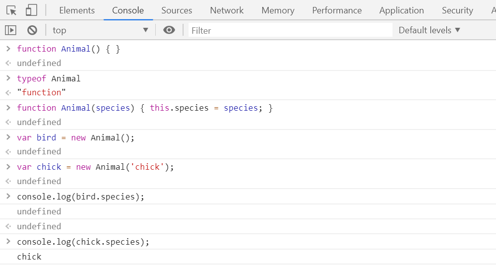
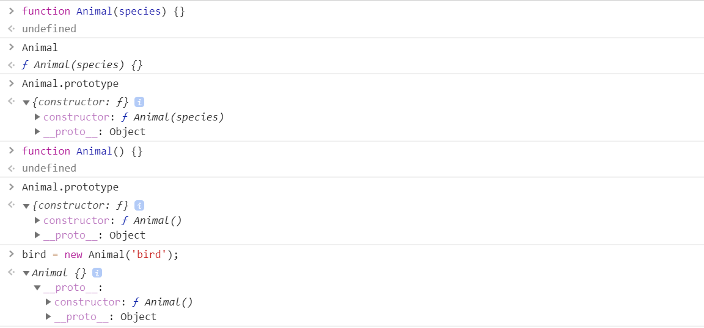

# 命名空间(NameSpace)

JavaScript的命名空间实际上就是一个JavaScript对象，其内部封装了一系列的变量，对象，函数等。

```js
// main.js
var MYAPP = {
  // 属性，变量
  appName: 'myapp',
  version: 'v1.0',
  // 方法
  date: function() {
    return new Date();
  }
  // 对象
  contributor: {
    name: ['greedy', 'gentle'],
    get: function() {
      return name[0];
    }
  }
}

// test.js
// 检查是否已经定义过该命名空间
var MYAPP = MYAPP || {};
```

> JavaScript中，全局变量实际上是window对象上的一个属性，这个对象是JavaScript自带的。

# 类(class)

JavaScript可以直接通过函数来声明一个类，用new来实例化：

```js
function Animal() {}
var bird = new Animal();
```

但是个人感觉这个模糊了类和函数的界限，语义不明。

比如上述的代码，Animal现在作为类的声明（但其本质依旧是一个函数），通过new去实例化。

学过java等OOP语言的都知道，``new``会自动调用类的构造器，但是这里并没有显式的定义类的构造器，隐式的……也没有。

``new``在这里调用的就是这个函数，所以可以知道类的构造器就是这个函数。

运行如下代码：

```js
// 声明类
function Animal() {}
function Animal(species) { this.species = species; }

// 查看类型
typeof Animal

// 实例化类
var bird = new Animal();
var chick = new Animal('chick');

// 查看类型
typeof bird
typeof chick
typeof bird.species
typeof chick.species
```

得到的结果如下图：



到这里我们会问另一个问题：``Animal()和Animal(species)是一个类吗？``

答案是否定的，为什么呢？因为我们说过，这里的function是用来声明类的，虽然增加了参数，但是并没有出现重载这种说法，而是直接覆盖了之前的定义。可以在控制台输入`Animal.prototype`查看其原型。



这都在说属性的定义，函数是如何定义的？

很简单，只需要绑定到原型(prototype)上即可。

```js
Animal.prototype.getSpecies() { console.log('Animal'); }
```

可以看到，这个函数是可以通过原型直接获取到的，我们也可以将其赋值给一个变量，通过这个变量去调用这个函数，但是要注意：
*** 如果这个函数中存在this指针，那么这个this指针绑定的就不是一个实例对象，而是window或其他，根据变量所处的位置决定。 ***

```js
// 全局作用域
Animal.prototype.getSpecies() { return this.species; }
var g = Animal.prototype.getSpecies();

g(); // 返回的是undefined，因为g是window的一个属性，而window中没有species属性。
```

通过以上，我们可以看到，JavaScript的面向对象其实是通过原型来模拟的。而在ES6之后，引入了class关键字，使得JavaScript的面向对象边的简单。

> JavaScript是基于原型的语言。
