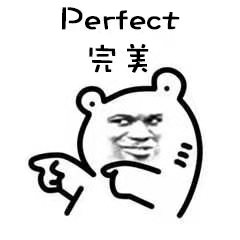
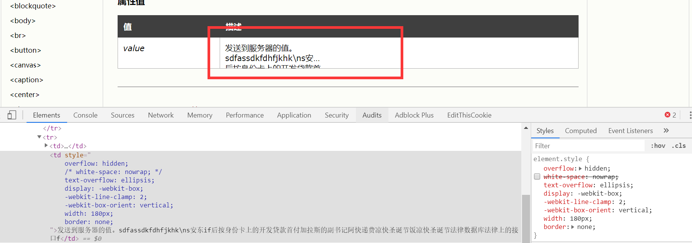
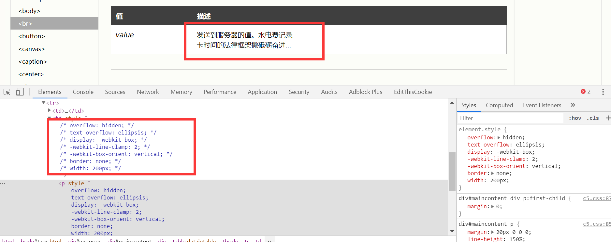

# 提需求的来了


某一期迭代时，新增了一个小功能，即：在单元格中的文本内容，字符超过20个字的时候，需要截断，并显示20个字符+一个省略号，未超过，无视。

这需求看上去不怎么复杂，看起来可以用css做（写css写魔怔了，啥都想往这上面靠拢），那先搜一下，字还没打完，就有提示“css限制显示字数，文字长度超出部分用省略号表示”，哎哟我c，这下不就简单了吗？


# 接受挑战

于是按照其他人的解决方案，对单元格样式增加了如下内容：

```css
/* td的上级和同级标签都用element表示 */
element element>td {
  overflow: hidden;
  text-overflow: ellipsis;
  display: -webkit-box;
  -webkit-line-clamp: 2;
  -webkit-box-orient: vertical;
}
```



| 姓名 | 爱好 | 个人介绍 |
| :------------- | :------------- | :------------- |
| 君子 | 音乐 | 我是一个君子，所谓窈窕淑女，我所欲也，怎样，姑娘加个微信可好？ |
| 贪婪 | 数钱 | 我是七宗罪中的贪婪，但好像我有点不太对劲，因为贪婪不应该只是对钱吧？ |

> 可以在这个表格上尝试，但是由于这个是markdown生成的表格，所以有些样式需要自己去改一下，下面的图片是我在w3cSchool中随便找了个表格改的样式。

搞定收工，看下结果准备收拾东西回家……



但是，这单元格怎么高度不对啊，而且显示的内容也不对。


我陷入了沉思……

于是在浏览器中的控制台增增减减以下几项内容：text-overflow，overflow，width，height，max-xxx，padding，margin……
但是发现木啥用，再度陷入沉思。

这时候我又回头看那些博客记录的内容，发现清一色都是用的p标签，没有用到其他的标签，想了想，也许是这个问题？于是换成了p标签，然后加上上述代码（以及一个margin:0），发现显示的确实成功截断并显示内容了。



> 这里注意，如果td中增加的是一个div标签，那么也不能够显示预期结果，如果对其增加一个属性```white-space: nowrap;```消去换行，以单行形式显示，那么也可以实现字符截断。

但是这时候又发现了一个问题，截断的长度貌似不好控制，如果仅仅只是汉字，那么可以用```width: 20em```或者```width: 10em```（两行显示），但显然，在使用英文的时候，这个属性就不可用了。


于是换一种思路。

> 后文以angular框架为例来讨论这个问题

文本字符数>=20的时候截断并显示对吧？那这个文本是哪里来的？

> 响应式嘛，那肯定是有绑定数据的。你说直接写在标签中的文本你怎么改？拿头改……不对，这种情况不就是DOM操作嘛，可以用原生js或者jQuery来完成，但这有啥意义我也不是清楚。可能在不使用框架的时候会很有用吧。

```html
<table>
  <thead>
    <th *ngFor="let label of labelList">{{ label }}</th>
  </thead>
  <tbody>
    <td *ngFor="let item of list">{{ item | clip }}</td>
  </tbody>
</table>
```

```js
@Pipe({ 'name': 'clip'})
export class clipPipe implements PipeTransform {
  transform(val: string) {
    if (val > 20) return val.slice(0, 20) + '...';
    return val;
  }
}
```

通过管道的方式，我们可以直接输出截断后的数据，当然也有其他方式，但是我也没有想到其他比较好的方法。

> 如果你有好的方法，可以留言评论，我尝试一下，嘿嘿


# 总结

有时候我们考虑问题的时候会陷入牛角尖，觉得只能从某个方向解决。

这时候可以先把问题放一下，看看窗外的风景，或者发会呆，平复一下心情，然后再去思考有没有其他的方式去解决我手上的这个问题。

发散思维嘛。
