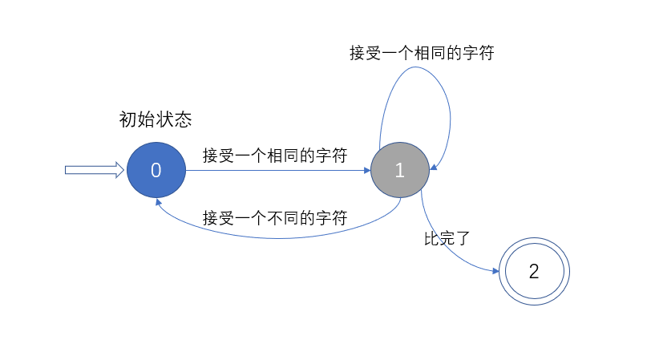

> 用了一个星期把《你不知道的JavaScript》看完了，但是留下了很多疑惑，于是又带着这些疑惑回头看JavaScript的内容，略有所获。

> 第二遍阅读这本书，希望自己能够有更为深刻的理解。

# 词法作用域

> ……如果是 **有状态** 的解析过程，还会赋予单词语义……

这本书是以编译原理的部份内容结合JavaScript来开篇的，所以如果没有学过编译原理，这一小部分内容显得有些晦涩。

虽然多数人没有接触过编译原理，但有一个东西必定知道，就是markdown语法。实际上，从markdown文件到HTML的过程就包含了词法化的过程。

那什么是有状态？粗略来讲，就是一个模式匹配的问题，或者可以认为是字符串的匹配：

***源串：`"str782yui"`，待匹配的串：`"sj1"`*** ，思考一下朴素匹配的算法，我们是要从头开始比较的，那么在每一次比较的时候，就两种状态，字符相同/不相同，每接受一个字符，就会走向其中一个状态。



这就是所谓的状态。当然了，这也只是一种粗浅的比喻，可能会有更好的。

说句心里话，编译原理是很有用的科目，但是真正学起来的时候还是挺痛苦的。

> 考虑以下代码：
> 
> ```javascript
> function foo(a) {
>   var b = a*2;
>   function bar(c) {
>       console.log(a, b, c);
>   }
>   bar(b*3);
> }
> foo(2);
> ```
> 
> 在这个例子中有三个逐级 **嵌套的作用域**……

对于java程序员来说，一对花括号就可以限制变量的作用域，而且作用域之间的关系有 **同级** 和 **父子级** 两种，同时还有包(package)这种很方便的东西。

但是JavaScript就不一样了，一对花括号是不能定义一个作用域的，而且由于var声明的变量存在变量提升，所以有些时候我们会发现某个变量并不能像预期的那样被约束在某对花括号中，于是就出现很多经典的问题。

JavaScript中函数和catch子块是能够创建作用域的，但是个人认为，为了创建一个作用域而使用catch子块，这等于是给catch增加了一个语义，二义性不好说，这可能会使程序变得不好阅读。但大家都这么做的话，那我也就随大流吧。

想起一个不知道从哪里传出来的笑话，说：catch不是异常处理关键字，而是流程控制语句。

提到了作用域，就一定要提变量的**屏蔽**，简单来说就一句话： ***内部作用域的变量会屏蔽外部作用域的同名变量***。

那可能就有人问了，（上述代码）我通过`foo.b`这种方式能不能访问呢？

……想啥呢？想对象了是吧？不过可以通过`window.foo`这种方式来访问全局变量foo，为啥？这`window`不是一个全局的对象嘛，所有的全局变量都会自动的成为全局对象的属性。

> ……词法作用域查找 **只会** 查找一级标识符……

这句话就是在回答上面我提出来的问题。

> ```javascript
> function foo(str, a) {
>   eval(str);
>   console.log(a, b);
> }
> var b = 2;
> foo("var b = 3", 1);
> ```
> 
> `eval(..)`调用中的"`var b = 3;`"这段diamante会被当做本来就在哪里一样处理……

这话说的好拗口啊？

有时候写程序的时候，我就会想，哎呀，要是能把一个字符串变成一个变量就好了，多方便啊。

eval差不多就是在完成这件事。书上说的这么绕，可能是为了可以让读者更好的理解。

在我看来，**eval函数所做的就是动态的生成一段代码，插入到对应的位置上，变成了另一个程序，照此执行。**

> with声明实际上是根据你传递给它的对象凭空创建了一个 **全新的词法作用域**。

到这里又增加了一个能够创建作用域的关键字。

```javascript
var obj = {
    a: 1
};
with(obj) {
    a = 2;
    b = 3;
};
```

对上述代码，我们可以这么理解，with将obj声明为一个作用域，with内部的语句都是在这个作用域中的，so……

> eval(..)和with会在运行时修改或创建新的作用域，以此来欺骗其他书写时定义的词法作用域。

eval是修改，with是创建作用域。

这两个都会导致程序性能的下降，原因是影响了**编译优化**，其实这俩就像是一个开关，任意一个存在时，都会打开禁止编译优化的按钮。就像是所谓的禁止指令重排一样。

# 总结

|ू･ω･` )：这本书真好看。