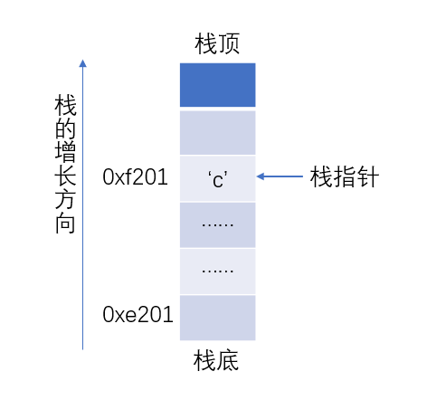
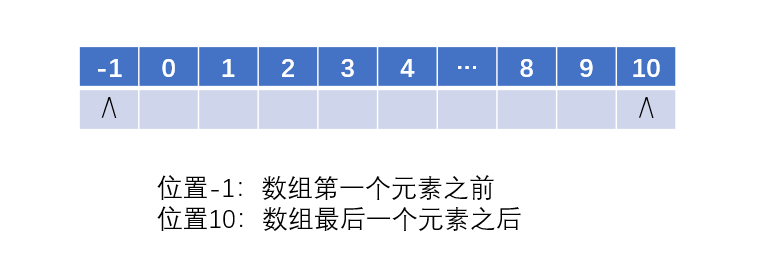
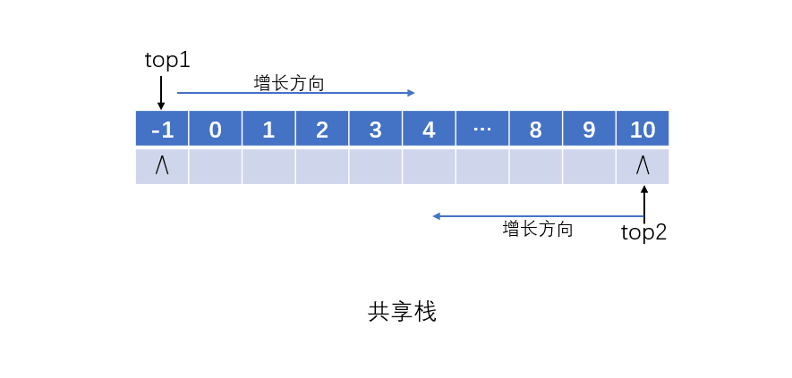
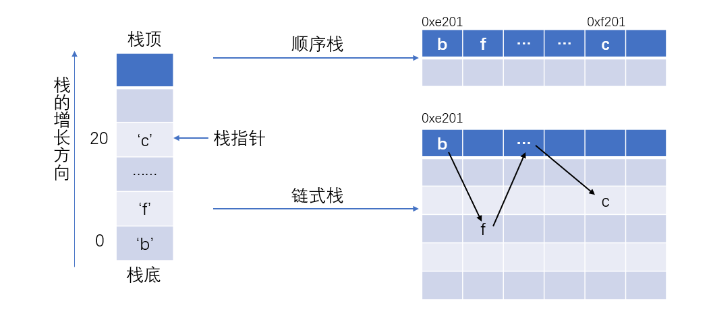

> 聊聊数据结构中的 **栈**

# 碎碎念

在[数据结构碎碎念（一）](https://iachieveall.com/archives/%E6%95%B0%E6%8D%AE%E7%BB%93%E6%9E%84%E7%A2%8E%E7%A2%8E%E5%BF%B5%EF%BC%88%E4%B8%80%EF%BC%89)中，提到了栈，这在计算机领域中可以说是非常重要的一个概念，我们可以在高级语言中找到其使用（如``stack<int>``），我们还可以在汇编语言中找到（助记符``push``，及相关的栈的概念），甚至于可以在硬件中看到栈的实现（如x86特有的浮点寄存器结构）。

我们在说栈的时候，通常指如下两种情况：

1. 编程中使用的栈（`stack<int>`）及其相关的操作。

2. 栈指针（不是`stack<int>`中的`top`变量，而是程序运行时栈溢出这类内存分配的问题）

> 有一个问题：我们通常所说的 **堆栈**，其实是 **堆** 和 **栈** 两个内容。对于堆的认识，聊得最多的是 **堆排序**，对语言底层比较了解的，会聊聊 *某某变量是在堆上分配，而某某变量则是在栈上分配*，再深一点会聊内存上的堆区和栈区（聊聊增长方向，缓存，生命周期之类的），更深入的……emmm……不好意思，我的水平有限，聊不下去了。

# 栈

在数据结构中对栈的定义十分简单： 一个 **只能对栈顶进行操作的线性表**。

这个定义中明确的规定了栈必须是一个线性表，同时隐式的限制了栈顶的数量。

可能会有人说，这个栈顶不是应该就只有一个吗？怎么就要讨论栈顶的数量？

如果栈顶是一个绝对概念（顶部就是上面，上面就是顶部），那么栈顶的确可以说只有一个。

但栈顶的定义其实是相对于栈底来说的，栈顶在上面，那么栈底就在下面，反之亦然。

> 就像我问，*两条平行线会相交吗？*，几乎所有人下意识的会回答，两条平行线永远不会相交，有错吗？
> 没错。但在回答这个问题之前，我们已经默认了这个问题是在欧式几何体系中讨论的。而在其他非欧式几何中，这个问题的答案就未必是这样了。

## 栈顶的数量

1. 栈顶数量为0，可以吗？

答案是否定的，如果不规定栈顶（没有栈顶），那就没有了操作的入口，那这个栈就没有存在的意义。

> 或者有人可能会说，这是不是从栈退化成一个普通的线性表了？这个我也不能明确的给出答案，因为栈本身就是一个线性表，只是施加了一个 **约束条件** 后，栈才具有了其特殊性。没有了这个约束条件，那也就不能称之为栈了。

2. 栈顶数量为1，标准栈

这种类型的栈我们首先就会想到自下而上增长的栈：



其实现如下：

```c++
const int MAXSIZE = 10;
// 1. 声明一个栈
int stack[MAXSIZE];
int top = -1;

// 2. 栈空
top == -1;

// 3. 栈满
top == MAXSIZE;

// 4. 压栈push(x)
stack[top++] = x;

// 5. 弹栈pop()
int x = stack[top--];

// 6. 读取栈顶元素
int x = stack[top];
```

这个实现方法可以说是通用的，只要是支持数组的语言，基本上都可以用该方法实现一个简单的固定大小的栈。

在这个实现中，我们默认将栈底设置在了-1索引位置处，栈的增长方向是 **-1->10** ，反过来设置也是可以的，因为栈底和栈顶的位置是相对的。

> **NOTE** ：在多数语言中，-1是一个非法的索引，使用stack[-1]会出现访问越界错误，而这个错误是一个致命错误（fetal error），会导致程序终止运行。但是某些语言中，-1却是是一个合法的索引，表示从后往前索引，即 `stack[-1] = stack[MAXSIZE-1];` 。
> 这里说-1索引，仅仅是表示数组第一个元素之前，不要试图访问、存取-1位置的值，这不仅仅是语言规定了该操作非法，同时，在内存中，-1对应的位置可能并没有初始化，访问该位置，可能会得到一个无效的值（如果真的访问成功，一般会是一个有符号的int型数值），可能这个位置已经被分给了其他的变量，或者程序，那么这时候访问成功，会使得其他程序，甚至于操作系统崩溃，带来无法挽回的损失。
> 当然了，编译器和虚拟机会检查这个问题，所以在数组中，咱没办法存取非法索引的内容，甚至只是访问都会报错。如果是链表实现的 **链式栈** ，就需要小心指针的使用了。

3. 栈顶数量为2的栈，存在吗？

当然存在，共享栈就是两个栈顶，分别对应位置-1和MAXSIZE，两边同时向中间增长。





```c++
top1 = -1;
top2 = MAXSIZE;

// top1压栈做自增操作，弹栈做自减操作
// top2压栈做自减操作，弹栈做自增操作
// 栈满是top1+1 == top2;
```

> 在内存中，栈和堆是共享自由空间的，有点像共享栈，所以我们直呼“堆栈堆栈”，还是有原因的。

4. 栈顶的数量大于2，存在吗？

目前为止，我们所讨论内容的都是一维的，再怎么开脑洞也找不到栈顶大于2的情况。

等等，如果强行对共享栈进行扩展，咱还真能找到栈顶数量大于2的情况，但这时候，我们应该就会发现本文的一个逻辑漏洞，这个漏洞对于本节的讨论是致命的。

# 致命的漏洞

本文在讨论栈的时候是以栈顶的数量为标准进行划分的，但看到这里，我们应该能发现一个逻辑漏洞，即当栈顶数量大于等于2的时候，他就是多个栈，而不是一个栈了。

所以，栈顶数量是不能作为栈类型的划分依据的，那本文在讨论什么？栈的复合吗？有点像诶。但是对于我们来说，好像下面这种使用才像是复合：

```c++
template <class T>
class MinStack<T> {
private:
  stack<T> st;
  stack<T> min;
}

// 最小栈的算法，还是挺经典的，可以自己查一查。
```

[最小栈](https://leetcode.com/problems/min-stack/description/)

# 总结

本文的内容，上一节算是总结，关于栈，还能聊两句基本的概念。

根据物理结构的不同，栈被划分成两个大类：

1. 顺序栈

采用顺序存储的栈称为顺序栈：就是在内存中申请一组 **连续的** 存储单元存放栈中的元素，可以认为就是数组实现。

2. 链式栈

采用链式存储的栈称为链式栈：栈中的元素在内存中 **不连续** ，同时每个存储单元中预留一小块位置存放下一个元素的地址，可以认为就是单链表实现。



> 想了想，实现一个栈并不是很难，在这里放一个实现，文章就有点长了，所以就不放代码了。

> <span style="color: white;">彩蛋|ू･ω･ )：能从本文中获得什么，也不是我说了能算的，只是希望，在这个谁都能发文章，谁都敢发文章，谁都敢说自己文章非常有深度的年代，不要被那些看似很有道理的、很有深度文章误导，要学会独立思考。不能对自己所说的话，所写过的文章负责的人，实在是太讨厌了。</span>
