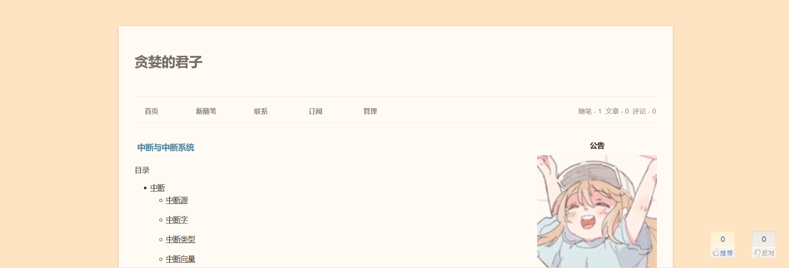
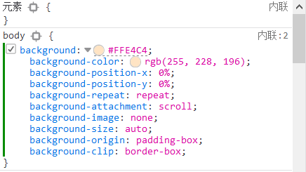
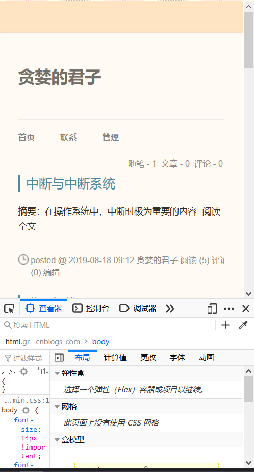
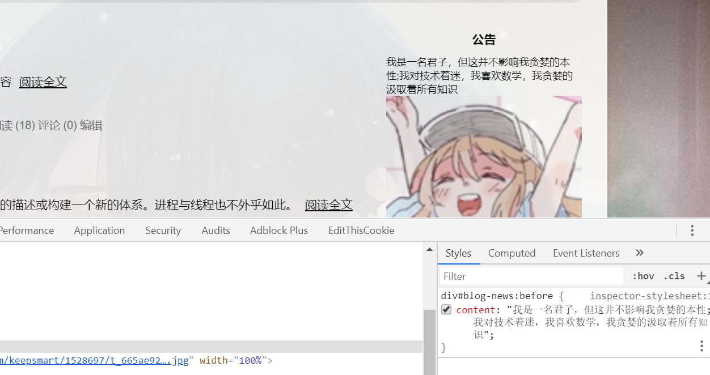

> 本文的所有实例均基于博客园的页面定制。
> 所有表格内容来自W3CSchool。

# 页面背景（background）

博客开通之后，很多人最先做的事情一定是改页面的背景，换成一张图片或者换上一个自己喜欢的颜色，这时候用到的就是background属性。

但是，在什么地方用呢？
> 所有的html标签都支持这个属性。所以，随便用。

我们经常能看到类似```background: #fff;```这种使用方式，如果背景是张图片，那可能会看到```background: url('xxx.jpg');```这种使用方式。

即使没有系统的学过css，仅看这两条代码也能知道前者是在设置背景色，后者则是在设置背景图片。
> 实际就是选择图片做背景还是选择颜色做背景。

那么现在设置一下博客的背景：

```css
body {
 background: #FFE4C4;
}
```



颜色确实改变了哈，同理可以设置图像背景。

我们在浏览器中检查元素（F12），可以看到background实际上是一系列属性的集合

。

对于单纯的背景颜色来说，这一系列的属性通常可以无视，对于图像背景，则按需设置这些内容（一般是```postion, size, repeat, attachment```这几条）。

这些属性的具体使用方式可以通过手册查找到，这里不再叙述。

上面换上了背景图像之后，我们使用手机打开，发现图像平铺了（未设置repeat），但是关闭了这条属性，手机浏览器只是居中显示一张图像(在手机上只能看到图像的一部分)，不好看，这显然是违背了我们更改样式的初衷（我们肯定是要美化博客不是）。

那怎么解决呢？这属于多终端兼容问题，并不是可以通过css就能解决的。可以通过响应式设计来解决。

负责任的说一句，css其实是可以解决这个问题的，但也只是简单的做一些适应性调整，个人认为这并非是一个很好的解决方案（有些场合可能就足够了，比如这里），解决方法用到的是@media查询。

```css
@media only screen and (max-width : 480px) {
 body {
   background: #FFE4C4;
 }  
}  
```

再打开手机浏览器就会发现背景不再是图像，而是纯色。这同样可以在电脑上预览。


附background的详细属性：

| 值	| 描述 | CSS标准支持 |
|:---|:---|:---|
| background-color | 规定要使用的背景颜色。 | 1 |
| background-position | 规定背景图像的位置。 | 1 |
| background-size | 规定背景图片的尺寸。 | 3 |
| background-repeat | 规定如何重复背景图像。 | 1 |
| background-origin | 规定背景图片的定位区域。 | 3 |
| background-clip | 规定背景的绘制区域。 | 3 |
| background-attachment | 规定背景图像是否固定或者随着页面的其余部分滚动。 | 1 |
| background-image | 规定要使用的背景图像。 | 1 |
| inherit | 规定应该从父元素继承 background 属性的设置。 | 1 |

> 建议使用background属性，而不是使用表中的单条属性。

# 伪元素

> 注意，是伪元素，而不是伪类。
> 伪元素针对元素的特定内容进行操作，伪类则是选择元素当前的状态。
> 关于伪元素和伪类的区别，可参考[寒月十八的文章](https://www.cnblogs.com/ihardcoder/p/5294927.html)

现在我想在公告栏加一段文字，应该怎么做，如果有js权限，那么可以通过：

```js
var boardcast = document.getElementById('#blog-news');
boardcast.before = "something";
boardcast.after = 'something';
```

但是为了加个固定的内容去申请js权限，显然是大材小用了，我们完全可以通过伪元素`:before`和`:after`来实现。

> css3的标准规定伪元素是以双冒号开头的，但是部分浏览器（如IE8）并不兼容，所以也依然支持单冒号的写法，为了向后兼容，咱也得写成单冒号开头的形式。在浏览器的控制台中，可以看到对应的标签后有一个`::before`。


具体为：

```css
div#blog-news:before {
    content: "我是一名君子，但这并不影响我贪婪的本性;我对技术着迷，我喜欢数学，我贪婪的汲取着所有知识";
}

div#blog-news:after {
    content: "粉丝好少，我好伤心";
}
```



这样一波操作，显然更简单，而且你会发现一个附加功用（是好是坏得自己判断），这个内容在网页内是不可选中的，但依旧可以通过浏览器的控制台找到该内容。

比js操作更方便的是，通过css，我们可以直接对这个content设定样式。

```css
div#blog-news:before {
    content: "我是一名君子，但这并不影响我贪婪的本性;我对技术着迷，我喜欢数学，我贪婪的汲取着所有知识";
    font-size: 16px;
    color: rebeccapurple;
}
```

> 这个还是有局限的，content中的内容只会被解析成字符串，即使有HTML标签，也会被当成字符串显示。
> 原因是，***css并不能改变DOM树***

这里列出几个比较常用的伪元素：

| 伪元素 | 描述 | CSS标准支持 |
|:---|:---|:---|
| :before | 在某个元素之前插入内容。 | 2 |
| :after | 在某个元素之后插入内容。| 2 |


# 伪类

我发现SimpleMemory模板的标题动画不太合我的口味，我鼠标放上去不能向右移，我想让他放大，这得改改。

鼠标放上去，这是一个状态，在上一节提到，**伪类是选择元素当前的状态**。

那么，我就可以根据当前元素的状态来应用不同的样式了。

```css
.postTitle a:hover {
	margin-left: 0px;
	color: #0f3647;
	text-decoration: underline;
	font-size: 25px;
}
```

但是这么做完之后，放大的速度有点慢，原因是什么？因为模板中设置了`transition: all 0.1s linear 0s;`，这是设置过渡效果的。

如果不设置这个属性，那么就不会有过渡效果。

> transition属性属于css3标准，所以低版本浏览器（IE8）是不兼容的。

这里列出部分出现次数最多的伪类：

| 伪类 | 描述 | CSS标准支持 |
|:---|:---|:---|
| :active | 向被激活的元素添加样式。 | 1 |
| :focus | 向拥有键盘输入焦点的元素添加样式。 | 2 |
| :hover | 当鼠标悬浮在元素上方时，向元素添加样式。 | 1 |
| :link | 向未被访问的链接添加样式。 | 1 |
| :visited | 向已被访问的链接添加样式。 | 1 |


# 锚点、定位

博客主页看上去基本没啥要改的了，那点进博文看看。

不错不错，也挺好，不过貌似缺点儿啥？

是目录！

虽然内置的有目录，但是这并不酷，而且用处好少，往下翻翻，这个目录就没了。怎么才能像别的网站那样右下角一直有个目录呢？

申请js权限之前，让我先想想css能不能做，毕竟js建个目录也挺复杂的。

这时候就顺势想到博文中已存在的目录，能不能对它操作呢？

找到这个目录结点，设置如下样式：

```css
div[attr='toc'] {
  position: fixed;
  right: 0;
  bottom: 0;
}
```

> 不过有点小问题，就是在手机之类的小屏幕上，这个目录可能就有点……但也可以通过上面提到过的@media来取消这里设定的样式。

这段css代码里面出现了一些以前没见过的东西，咱先看看position。

position有五种可能值，详细如下：

| 值 | 描述 |
|:---|:---|
| absolute | 生成绝对定位的元素，相对于 static 定位以外的第一个父元素进行定位。元素的位置通过 "left", "top", "right" 以及 "bottom" 属性进行规定。|
| fixed	| 生成绝对定位的元素，相对于浏览器窗口进行定位。元素的位置通过 "left", "top", "right" 以及 "bottom" 属性进行规定。 |
| relative | 生成相对定位的元素，相对于其正常位置进行定位。因此，"left:20" 会向元素的 LEFT 位置添加 20 像素。 |
| static | 默认值。没有定位，元素出现在正常的流中（忽略 top, bottom, left, right 或者 z-index 声明）。 |
| inherit | 规定应该从父元素继承 position 属性的值。|
>  CSS3标准中新增了一个sticky:粘性定位<br>
> 一般说定位的时候，都是在说前面三种<br>
> position: 绝对定位<br>
> relative: 相对定位<br>
> fixed: 固定定位

看完这张表可能也不能完全理解absolute和relative。

其实主要是没懂文档流，上面表格的内容主要就是说文档流的问题，设置为absolute的元素会脱离文档流，设置为relative的元素不会脱离文档流，设置为fixed的元素会脱离文档流。
